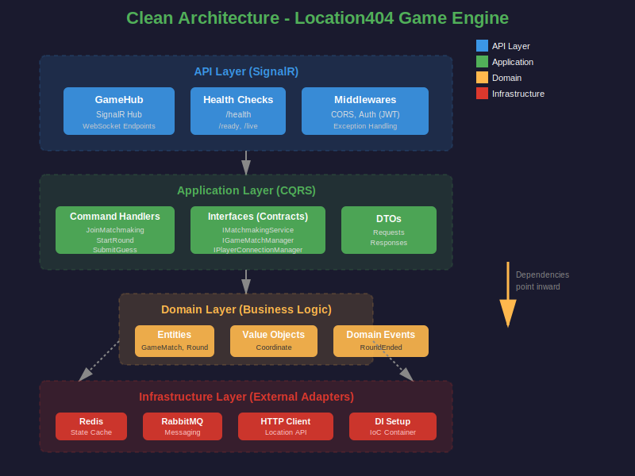

# 🎮 Location404 Game Engine

Motor de jogo em tempo real para o Location404 - sistema de matchmaking, gerenciamento de partidas e rounds para jogo de adivinhação geográfica competitivo multiplayer.

[](https://dotnet.microsoft.com/)
[](https://dotnet.microsoft.com/apps/aspnet/signalr)
[](https://redis.io/)
[](https://www.rabbitmq.com/)
[](LICENSE)

## 📋 Índice

- [Sobre o Projeto](#-sobre-o-projeto)
- [Funcionalidades](#-funcionalidades)
- [Arquitetura](#-arquitetura)
- [Tecnologias](#-tecnologias)
- [Pré-requisitos](#-pré-requisitos)
- [Instalação](#-instalação)
- [Configuração](#%EF%B8%8F-configuração)
- [Como Usar](#-como-usar)
- [API SignalR](#-api-signalr)
- [Estrutura do Projeto](#-estrutura-do-projeto)
- [Testes](#-testes)
- [Observabilidade](#-observabilidade)
- [Licença](#-licença)

## 🎯 Sobre o Projeto

O **Location404 Game Engine** é o serviço responsável por toda a lógica de jogo em tempo real do Location404. Utilizando **SignalR** para comunicação bidirecional, o serviço gerencia:

- **Matchmaking**: Sistema de fila para encontrar oponentes
- **Game Matches**: Partidas 1v1 com 3 rounds cada
- **Game Rounds**: Rodadas individuais com locations aleatórias
- **Scoring System**: Cálculo de pontos baseado em distância (fórmula exponencial)
- **Real-time Events**: Notificações instantâneas via WebSockets

### Como Funciona

1. **Jogador entra na fila** → Sistema busca oponente disponível
2. **Match criado** → 2 jogadores são pareados automaticamente
3. **Round iniciado** → Location aleatória é selecionada da API de dados
4. **Jogadores fazem palpites** → Coordenadas são enviadas via SignalR
5. **Round termina** → Pontos calculados com base na distância do erro
6. **3 rounds completados** → Match termina, evento publicado no RabbitMQ

## ✨ Funcionalidades

### Matchmaking
- ✅ Fila de espera com timestamp (FIFO)
- ✅ Pareamento automático de 2 jogadores
- ✅ Cleanup de matches abandonadas
- ✅ Suporte a reconexão

### Gestão de Partidas
- ✅ Matches 1v1 com 3 rounds obrigatórios
- ✅ Estado persistido em Redis (cache distribuído)
- ✅ Sistema de pontuação exponencial baseado em distância
- ✅ Detecção de empates
- ✅ Timeout automático de 2 horas

### Rounds
- ✅ Seleção aleatória de locations via API externa
- ✅ Validação de coordenadas (lat: -90 a 90, lng: -180 a 180)
- ✅ Cálculo geodésico de distância (Haversine)
- ✅ Parâmetros de StreetView (heading, pitch)

### Eventos em Tempo Real
- ✅ `MatchFound` - Match criado com sucesso
- ✅ `RoundStarted` - Novo round iniciado
- ✅ `GuessSubmitted` - Palpite confirmado
- ✅ `RoundEnded` - Round finalizado com resultados
- ✅ `MatchEnded` - Partida completa com vencedor

## 🏗️ Arquitetura

O projeto segue **Clean Architecture** com separação clara de responsabilidades:

<p align="center">
  
</p>

### Fluxo de Dados

<p align="center">
  
</p>

```
Frontend (SignalR Client)
    │
    ├─ JoinMatchmaking ──► Matchmaking Queue (Redis)
    │                      │
    │                      ├─ 2 players found
    │                      │
    ├─◄ MatchFound        Match Created (Redis)
    │                      │
    ├─ StartRound ────────►│
    │                      ├─ Fetch Random Location (HTTP → location404-data API)
    │                      │
    ├─◄ RoundStarted       Store Round State (Redis)
    │                      │
    ├─ SubmitGuess ───────►│
    │                      ├─ Both guesses received?
    │                      │
    │                      ├─ YES: Calculate distance & points
    ├─◄ RoundEnded        │     Store results
    │                      │
    │                      ├─ Match complete (3 rounds)?
    │                      │
    ├─◄ MatchEnded         ├─ YES: Publish to RabbitMQ (match.ended)
                           │     Clean up Redis state
                           │
                           └─► location404-data (processes stats)
```

## 🛠️ Tecnologias

### Backend
- **.NET 9.0** - Framework principal
- **ASP.NET Core SignalR** - Comunicação real-time WebSocket
- **LiteBus** - CQRS pattern (Command Handlers)
- **StackExchange.Redis** - State management distribuído

### Messaging & Cache
- **Redis/Dragonfly** - Cache de estado de jogo e matchmaking
- **RabbitMQ** - Event-driven messaging (match.ended, round.ended)

### Observability
- **OpenTelemetry** - Distributed tracing
- **Shared.Observability** - Pacote NuGet customizado
- **Prometheus** - Métricas
- **Grafana Loki** - Logs estruturados

### Testing
- **xUnit** - Framework de testes
- **FluentAssertions** - Assertions expressivas
- **Moq** - Mocking
- **Testcontainers** - Integration tests com Redis

## 📦 Pré-requisitos

- [.NET 9 SDK](https://dotnet.microsoft.com/download/dotnet/9.0)
- [Redis](https://redis.io/download) ou [Dragonfly](https://www.dragonflydb.io/) (porta 6379)
- [RabbitMQ](https://www.rabbitmq.com/download.html) (porta 5672)
- [location404-data](https://github.com/Location404/location404-data) rodando (porta 5000)

**Opcional:**
- [Docker](https://www.docker.com/) - Para rodar dependências via containers

## 🚀 Instalação

### 1. Clone o repositório

```bash
git clone https://github.com/Location404/location404-game.git
cd location404-game
```

### 2. Restaurar dependências

```bash
dotnet restore
```

### 3. Build do projeto

```bash
dotnet build
```

## ⚙️ Configuração

### appsettings.json

Edite `src/Location404.Game.API/appsettings.json` ou use **variáveis de ambiente** (recomendado para produção):

```json
{
  "Redis": {
    "Enabled": true,
    "ConnectionString": "localhost:6379",
    "InstanceName": "GameCoreEngine:",
    "DefaultExpiration": "02:00:00"
  },

  "RabbitMQ": {
    "Enabled": true,
    "HostName": "localhost",
    "Port": 5672,
    "UserName": "admin",
    "Password": "your_password_here",
    "VirtualHost": "/",
    "ExchangeName": "game-events",
    "MatchEndedQueue": "match-ended",
    "RoundEndedQueue": "round-ended"
  },

  "Location404Data": {
    "BaseUrl": "http://localhost:5000",
    "TimeoutSeconds": 10
  },

  "Cors": {
    "AllowedOrigins": [
      "http://localhost:5173",
      "http://localhost:4200"
    ]
  },

  "JwtSettings": {
    "Issuer": "location404",
    "Audience": "location404",
    "SigningKey": "your-secret-key-min-32-chars-here",
    "AccessTokenMinutes": 60
  }
}
```

### Variáveis de Ambiente (Docker/Produção)

```bash
# Redis
Redis__Enabled=true
Redis__ConnectionString=redis:6379

# RabbitMQ
RabbitMQ__Enabled=true
RabbitMQ__HostName=rabbitmq
RabbitMQ__Password=secure_password

# External API
Location404Data__BaseUrl=http://location404-data:5000

# JWT
JwtSettings__SigningKey=your-super-secret-signing-key-here

# CORS
Cors__AllowedOrigins__0=https://location404.com
```

## 🎮 Como Usar

### Desenvolvimento Local

```bash
# 1. Inicie o Redis (ou use Docker)
docker run -d -p 6379:6379 redis:latest

# 2. Inicie o RabbitMQ (opcional)
docker run -d -p 5672:5672 -p 15672:15672 rabbitmq:3-management

# 3. Certifique-se que location404-data está rodando
# Veja: https://github.com/Location404/location404-data

# 4. Execute o Game Engine
cd src/Location404.Game.API
dotnet run
```

A API estará disponível em:
- **SignalR Hub**: `http://localhost:5170/gamehub`
- **Health Check**: `http://localhost:5170/health`
- **Metrics**: `http://localhost:5170/metrics`

### Docker Compose (Recomendado)

```bash
cd location404-utils/deploy/dev
docker-compose up -d
```

## 📡 API SignalR

### Conectar ao Hub

```typescript
import * as signalR from '@microsoft/signalr';

const connection = new signalR.HubConnectionBuilder()
    .withUrl('http://localhost:5170/gamehub', {
        accessTokenFactory: () => yourJwtToken
    })
    .withAutomaticReconnect()
    .build();

await connection.start();
```

### Métodos Disponíveis

#### 1. JoinMatchmaking

Entra na fila de matchmaking.

**Request:**
```typescript
const request = { playerId: 'guid-here' };
const result = await connection.invoke('JoinMatchmaking', request);
// Returns: "Added to queue..." ou "Match found!"
```

**Events:**
- `MatchFound` - Disparado quando match é criado

```typescript
connection.on('MatchFound', (data) => {
    console.log('Match ID:', data.matchId);
    console.log('Opponent:', data.playerBId);
    console.log('Start Time:', data.startTime);
});
```

#### 2. LeaveMatchmaking

Sai da fila de matchmaking.

```typescript
await connection.invoke('LeaveMatchmaking', playerId);
```

**Events:**
- `LeftQueue` - Confirmação de saída

#### 3. StartRound

Inicia um novo round (qualquer jogador pode chamar).

**Request:**
```typescript
const request = { matchId: 'guid-here' };
await connection.invoke('StartRound', request);
```

**Events:**
- `RoundStarted` - Round iniciado com location data

```typescript
connection.on('RoundStarted', (data) => {
    console.log('Round Number:', data.roundNumber);
    console.log('Location:', {
        lat: data.location.x,
        lng: data.location.y,
        heading: data.location.heading,
        pitch: data.location.pitch
    });
    console.log('Duration:', data.durationSeconds, 'seconds');
});
```

#### 4. SubmitGuess

Envia palpite de coordenadas.

**Request:**
```typescript
const request = {
    matchId: 'guid-here',
    playerId: 'guid-here',
    guessX: -23.5505,  // Latitude
    guessY: -46.6333   // Longitude
};

await connection.invoke('SubmitGuess', request);
```

**Events:**
- `GuessSubmitted` - Confirmação de palpite
- `RoundEnded` - Disparado quando ambos jogadores enviaram palpites

```typescript
connection.on('RoundEnded', (data) => {
    console.log('Correct Answer:', {
        lat: data.correctAnswer.x,
        lng: data.correctAnswer.y
    });

    console.log('Player A:', {
        guess: data.playerAGuess,
        distance: data.playerADistance + ' km',
        points: data.playerAPoints
    });

    console.log('Player B:', {
        guess: data.playerBGuess,
        distance: data.playerBDistance + ' km',
        points: data.playerBPoints
    });
});
```

- `MatchEnded` - Disparado após 3 rounds completos

```typescript
connection.on('MatchEnded', (data) => {
    console.log('Winner:', data.winnerId);
    console.log('Loser:', data.loserId);
    console.log('Final Score:', {
        playerA: data.playerATotalPoints,
        playerB: data.playerBTotalPoints
    });
    console.log('Points Earned:', data.pointsEarned);
    console.log('Points Lost:', data.pointsLost);
    console.log('All Rounds:', data.rounds);
});
```

### Sistema de Pontuação

```
points = 5000 × e^(-distance_km / 2000)

Exemplos:
- 0 km (perfeito):     5000 pontos
- 100 km:              4756 pontos
- 500 km:              3894 pontos
- 1000 km:             3033 pontos
- 2000 km:             1839 pontos
- 5000 km:              410 pontos
```

Distância calculada com **Haversine formula** (geodésica).

## 📂 Estrutura do Projeto

```
location404-game/
├── src/
│   ├── Location404.Game.API/                    # API Layer (SignalR Hub)
│   │   ├── Hubs/
│   │   │   └── GameHub.cs                       # SignalR Hub principal
│   │   ├── Middlewares/
│   │   │   └── ExceptionHandlingMiddleware.cs
│   │   ├── Program.cs                           # Entry point + DI setup
│   │   └── appsettings.json
│   │
│   ├── Location404.Game.Application/            # Application Layer (CQRS)
│   │   ├── Features/
│   │   │   ├── Matchmaking/
│   │   │   │   ├── Commands/
│   │   │   │   │   └── JoinMatchmakingCommand/
│   │   │   │   └── Interfaces/
│   │   │   │       ├── IMatchmakingService.cs
│   │   │   │       └── IPlayerConnectionManager.cs
│   │   │   │
│   │   │   └── GameRounds/
│   │   │       ├── Commands/
│   │   │       │   ├── StartRoundCommand/
│   │   │       │   └── SubmitGuessCommand/
│   │   │       ├── Interfaces/
│   │   │       │   └── IGameMatchManager.cs
│   │   │       └── RoundEndedResponse.cs
│   │   │
│   │   ├── Common/
│   │   │   ├── Result/                          # Result pattern (success/failure)
│   │   │   └── Interfaces/
│   │   │       └── ILocationService.cs
│   │   │
│   │   └── Events/
│   │       ├── MatchEndedEvent.cs
│   │       └── RoundEndedEvent.cs
│   │
│   ├── Location404.Game.Domain/                 # Domain Layer (Entities)
│   │   ├── Entities/
│   │   │   ├── GameMatch.cs                     # Aggregate root (Match)
│   │   │   └── GameRound.cs                     # Round entity
│   │   │
│   │   └── ValueObjects/
│   │       ├── Coordinate.cs                    # Lat/Lng value object
│   │       └── Location.cs                      # StreetView location
│   │
│   └── Location404.Game.Infrastructure/         # Infrastructure (Redis, RabbitMQ, HTTP)
│       ├── Persistence/
│       │   ├── GameMatchManager.cs              # Redis-based match storage
│       │   ├── MatchmakingService.cs            # Redis queue implementation
│       │   └── PlayerConnectionManager.cs       # SignalR connection mapping
│       │
│       ├── Messaging/
│       │   └── RabbitMQPublisher.cs             # RabbitMQ event publisher
│       │
│       ├── ExternalServices/
│       │   └── LocationService.cs               # HTTP client for location404-data
│       │
│       └── DependencyInjection.cs
│
├── tests/
│   ├── Location404.Game.Application.UnitTests/
│   │   ├── Commands/
│   │   │   ├── JoinMatchmakingCommandTests.cs
│   │   │   ├── StartRoundCommandTests.cs
│   │   │   └── SubmitGuessCommandTests.cs
│   │   └── Services/
│   │
│   └── Location404.Game.Infrastructure.IntegrationTests/
│       ├── Persistence/
│       │   ├── GameMatchManagerTests.cs
│       │   └── MatchmakingServiceTests.cs
│       └── TestContainersFixture.cs             # Redis container setup
│
├── Location404.Game.sln
├── README.md
└── .gitignore
```

## 🧪 Testes

### Executar Todos os Testes

```bash
dotnet test
```

### Testes Unitários (Application Layer)

```bash
dotnet test tests/Location404.Game.Application.UnitTests
```

### Testes de Integração (com Testcontainers)

```bash
dotnet test tests/Location404.Game.Infrastructure.IntegrationTests
```

**Nota:** Testes de integração requerem Docker rodando (usa Testcontainers para Redis).

### Cobertura de Código

```bash
dotnet test --collect:"XPlat Code Coverage"
reportgenerator -reports:"**/coverage.cobertura.xml" -targetdir:"TestResults/Report"
```

Abra `TestResults/Report/index.html` no navegador.

## 📊 Observabilidade

### Métricas (Prometheus)

Endpoint: `http://localhost:5170/metrics`

**Métricas customizadas:**
- `game_matchmaking_queue_size` - Tamanho da fila de matchmaking
- `game_active_matches_total` - Número de matches ativas
- `game_rounds_started_total` - Total de rounds iniciados
- `game_guesses_submitted_total` - Total de palpites enviados
- `game_matches_completed_total` - Total de matches completadas

### Traces (OpenTelemetry)

Configurado para exportar para coletor OTLP:
- Endpoint: `http://181.215.135.221:4317`
- Sampling: 10% em produção, 100% em desenvolvimento

**Traces automáticos:**
- SignalR method calls
- HTTP requests (outbound)
- Redis operations
- RabbitMQ publishes

### Logs (Structured)

Logs estruturados exportados para Grafana Loki:
- Formato: JSON
- Trace correlation: `trace_id`, `span_id`
- Enriched com properties: `player_id`, `match_id`, `round_id`

### Health Checks

```bash
# Health geral
curl http://localhost:5170/health

# Readiness (dependências prontas?)
curl http://localhost:5170/health/ready

# Liveness (processo vivo?)
curl http://localhost:5170/health/live
```

**Dependências verificadas:**
- Redis (timeout: 5s)
- RabbitMQ (timeout: 5s)
- location404-data API (timeout: 10s)

## 📄 Licença

Este projeto está sob a licença **MIT**. Veja o arquivo [LICENSE](LICENSE) para mais detalhes.

---

## 🔗 Links Relacionados

- [location404-web](https://github.com/Location404/location404-web) - Frontend Vue.js
- [location404-auth](https://github.com/Location404/location404-auth) - Serviço de autenticação
- [location404-data](https://github.com/Location404/location404-data) - API de dados e estatísticas
- [shared-observability](https://github.com/Location404/shared-observability) - Pacote de observabilidade

## 📞 Suporte

- **Issues**: [GitHub Issues](https://github.com/Location404/location404-game/issues)
- **Discussões**: [GitHub Discussions](https://github.com/Location404/location404-game/discussions)

---

<p align="center">
  Desenvolvido por <a href="https://github.com/ryanbromati">ryanbromati</a>
</p>
